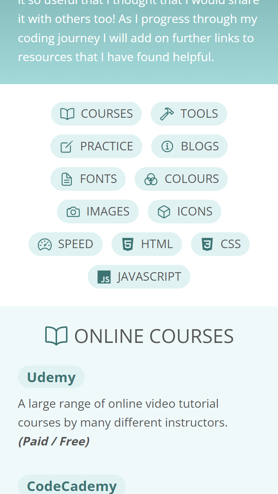

# Coding Resources Page

## Table of contents

- [Project Overview](#project-overview)
- [Coding Resources Page](#coding-resources-page-1)
  - [Screenshots](#screenshots)
  - [Links](#links)
- [Process](#process)
  - [Built with](#built-with)
  - [What I learned](#what-i-learned)
  - [Continued development](#continued-development)
  - [Useful resources](#useful-resources)
- [Author](#author)

## Project Overview

As part of my coding journey, I've come across so many links that I bookmarked to check out later and then would find it difficult to find the links that I found really helpful. This is where this coding resources page started out, to help me locate the links I would want to go back to again. I've found it so useful that I thought that I would share it with others too! As I progress through my coding journey I will add on further links to resources that I have found helpful.

## Coding Resources Page

### Screenshots

Desktop:  


Mobile:


### Links

- Solution URL: [https://github.com/VTickner/coding-resources](https://github.com/VTickner/coding-resources)
- Live Site URL: [https://vtickner.github.io/coding-resources/](https://vtickner.github.io/coding-resources/)

## Process

- Created the basic structure of the HTML resources page, using BEM naming convention for CSS classes and adding in icons.
- Created the CSS for the basic colour scheme and font sizing. (Used custom properties to contain the various colours used.)
- Created the CSS layout using flexbox and grid.
- Adjusted spacing between elements using a spacing system to give a consistent look.
- Edited :focus to match styling of links for keyboard only users.
- Added JavaScript to enable the following functionality:
  - Sticky navigation for menu navigation links.
  - Smooth scrolling for menu navigation links.
  - Set current year in copyright statement.
- Changed from using `font-size: 62.5%` technique to using CSS variables to hold size measurements that want to use with `rem` units.
- Made page mobile responsive:
  - Added media queries to CSS.
  - Removed sticky navigation for smaller screens (when using 1 column grid)

### Built with

- HTML
- CSS
  - Flexbox
  - Grid
  - Custom properties
- JavaScript
- SVG Icons

### What I learned

To use `:focus-within` on parent elements of links to allow the focus outline to match the outline of the button links.

As part of [The Complete JavaScript Course 2023: From Zero to Expert!](https://www.udemy.com/course/the-complete-javascript-course/) course on Udemy, I have learnt in more detail how to work with the DOM and have a better understanding of how to implement scrolling and sticky navigation functionality. I decided to implement these functionalities in one of my own personal projects and felt this was a suitable project to do so. For this project I needed to alter the scrolling functionality so that it wouldn't scroll to the top of the viewport but to the bottom of the sticky navigation bar. I used ChatGPT to help me with modifying my code to get the correct positioning I wanted.

```js
document.querySelector(".nav__list").addEventListener("click", function (e) {
  e.preventDefault();
  if (e.target.classList.contains("nav__link")) {
    const id = e.target.getAttribute("href");
    const navHeight = nav.getBoundingClientRect().height;
    const targetElement = document.querySelector(id);

    if (targetElement) {
      const targetPosition =
        targetElement.getBoundingClientRect().top + window.scrollY - navHeight;
      window.scrollTo({
        top: targetPosition,
        behavior: "smooth",
      });
    }
  }
});
```

Scrolling to bottom of sticky navigation:  


I also needed to remove the sticky navigation bar for smaller screens, so checks needed to be added as to whether to add or remove the sticky navigation bar based also on the `window.innerWidth` size plus the observer needed to be re-run whenever the window is resized.

```js
const header = document.querySelector(".header");
const nav = document.querySelector(".nav");
const navHeight = nav.getBoundingClientRect().height;

const isDesktopView = () => window.innerWidth >= 735;

const stickyNav = function (entries) {
  const [entry] = entries;
  if (!entry.isIntersecting && isDesktopView()) nav.classList.add("sticky");
  else nav.classList.remove("sticky");
};

const headerObserver = new IntersectionObserver(stickyNav, {
  root: null,
  threshold: 0,
  rootMargin: `-${navHeight}px`,
});

headerObserver.observe(header);

window.addEventListener("resize", function () {
  if (isDesktopView()) {
    headerObserver.observe(header);
  } else {
    nav.classList.remove("sticky");
    headerObserver.unobserve(header);
  }
});
```

### Continued development

To improve my JavaScript knowledge and capabilities by completing [The Complete JavaScript Course 2023: From Zero to Expert!](https://www.udemy.com/course/the-complete-javascript-course/) course.

### Useful resources

- [CSS BEM Naming Methodology](https://getbem.com/naming/) - Official BEM site
- [Ionicons](https://ionic.io/ionicons) - Free, open source icon library.
- [Tint & Shade Generator](https://maketintsandshades.com/) - Free tool that calculates tints and shades for your default colour, to enable you to create a cohesive colour scheme.
- [The Complete JavaScript Course 2023: From Zero to Expert!](https://www.udemy.com/course/the-complete-javascript-course/) - A paid for JavaScript course on Udemy.
- [ChatGPT](https://chat.openai.com/auth/login) - AI tool. Useful for debugging and correcting code (but doesn't always answer correctly, so use with caution and thoroughly check the AI's suggestion).

## Author

- V. Tickner
